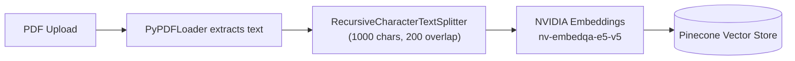
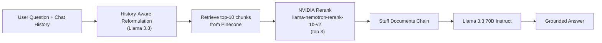

# Sentinel Engine

A Hybrid-RAG backend for conversational, document-grounded Q&A — built with FastAPI, LangChain, NVIDIA AI Endpoints, and Pinecone.

## Demo

**[Watch the demo video](https://youtu.be/lnetexZpv_Y)**

A short walkthrough covering the full pipeline end to end: uploading a new PDF and watching it get chunked and embedded live, asking a question the document actually answers, asking an out-of-scope question to show the grounding guardrail refuse to hallucinate, and a follow-up question that only resolves correctly using prior chat history.

## Overview

Sentinel Engine lets a user upload a PDF and ask natural-language questions about it, with answers grounded strictly in the document's content. Rather than letting the model freely generate, the system retrieves the most relevant chunks, reranks them for precision, and explicitly instructs the LLM to say it doesn't know rather than hallucinate when the answer isn't in the retrieved context. It also maintains conversational memory, so follow-up questions resolve correctly using prior chat history.

## Architecture

**Ingestion pipeline** (triggered on PDF upload):



**Query pipeline** (triggered on chat message):



## Key Features

- **Live ingestion** — upload new PDFs at runtime; they're queryable immediately without restarting the server, since the retriever reads live from Pinecone.
- **Reranked retrieval** — an initial top-10 dense retrieval pass is refined down to the top 3 most relevant chunks using NVIDIA's rerank model, improving answer precision over plain vector search.
- **History-aware retrieval** — follow-up questions are reformulated into standalone queries using prior chat turns before retrieval runs.
- **Grounded, hallucination-resistant answers** — the model is explicitly instructed to decline rather than fabricate when context doesn't contain the answer.

## Tech Stack

| Layer | Technology |
|---|---|
| Backend | FastAPI |
| LLM | Llama 3.3 70B Instruct (via NVIDIA AI Endpoints) |
| Embeddings | NVIDIA `nv-embedqa-e5-v5` (1024-dim) |
| Reranker | NVIDIA `llama-nemotron-rerank-1b-v2` |
| Vector Database | Pinecone |
| Orchestration | LangChain |
| Frontend | Next.js + Tailwind CSS |

## API Reference

### `GET /`
Health check.

### `POST /upload`
Multipart file upload. Ingests a PDF into Pinecone.

```bash
curl -X POST http://localhost:8000/upload \
  -F "file=@document.pdf"
```

**Response**
```json
{
  "status": "success",
  "message": "document.pdf successfully ingested.",
  "chunks_embedded": 42
}
```

### `POST /chat`
Ask a question, optionally with prior conversation history.

```bash
curl -X POST http://localhost:8000/chat \
  -H "Content-Type: application/json" \
  -d '{
    "question": "What were the key findings?",
    "history": [
      {"role": "user", "content": "Summarize the document"},
      {"role": "assistant", "content": "The document covers..."}
    ]
  }'
```

**Response**
```json
{ "answer": "..." }
```

## Getting Started

### Prerequisites
- Python 3.11+
- Node.js 18+ (for the frontend)
- A [Pinecone](https://www.pinecone.io/) index named `sentinel-index` (1024 dimensions, cosine similarity)
- An [NVIDIA AI Endpoints](https://build.nvidia.com/) API key

### Installation

```bash
# Clone the repo
git clone https://github.com/<your-username>/sentinel-engine.git
cd sentinel-engine

# Backend
python -m venv venv
source venv/bin/activate  # or venv\Scripts\activate on Windows
pip install -r requirements.txt

# Configure environment variables
cp .env.example .env
# then fill in NVIDIA_API_KEY and PINECONE_API_KEY

# Run the API
uvicorn main:app --reload
```

```bash
# Frontend (in a separate terminal)
cd frontend
npm install
npm run dev
```

### Environment Variables

| Variable | Description |
|---|---|
| `NVIDIA_API_KEY` | API key for NVIDIA AI Endpoints (embeddings, rerank, LLM) |
| `PINECONE_API_KEY` | API key for your Pinecone project |

## Roadmap

- [ ] Rebuild orchestration with LangGraph for agentic, multi-step reasoning
- [ ] Wire up true sparse+dense hybrid retrieval (BM25 + Pinecone ensemble — imports already scaffolded)
- [ ] Streaming token-by-token responses
- [ ] Multi-document comparison / cross-referencing
- [ ] Production deployment

## License

This project is licensed under the MIT License.

## Contact

Your Name — your.email@example.com — [LinkedIn](#) — [GitHub](#)
